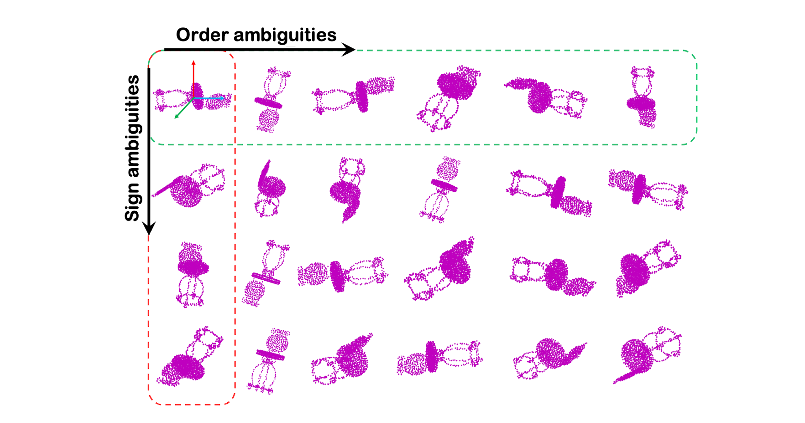

# Rotation-invariant-deep-pointcloud-analysis


#### Code for the ICCV 2021 paper: [A-closer-look-at-rotation-invariant-deep-pointcloud-analysis](https://drive.google.com/file/d/1kLYvQEF7pBpl6goOxDjkLUUpieWvZy53/view?usp=sharing). The supplementary material is [here](https://drive.google.com/file/d/1P5C4lwtncFiBBaleHqUMEKYAaypUaX2a/view?usp=sharing).

##### Authors: [Feiran Li](https://sites.google.com/view/feiranlihomepage/home), [Kent Fujiwara](https://kfworks.com/), [Fumio Okura](http://cvl.ist.osaka-u.ac.jp/user/okura/), and [Yasuyuki Matsushita](http://cvl.ist.osaka-u.ac.jp/en/member/matsushita/)


### TODO: provide a script to generate all the 24 poses from a given point cloud.





### 1. Requirement
The provided codes have been tested on Pytorch-1.6.0 with Tesla-V100.


### 1. Run the code
1. Download the PCA-processed datasets ([ModelNet40](https://drive.google.com/file/d/1RVG83T3g8bXbG_mYK_UiCJkJTbdehhkf/view?usp=sharing), [ShapeNet-PartSeg](https://drive.google.com/file/d/1jUFIMoqPp1UuO8Eb1T1khGdMoxfdBm-H/view?usp=sharing), and [ScanObjectNN](https://drive.google.com/file/d/1278dJdE5-gaRxjtMWDIF7i-bF2_E1sPh/view?usp=sharing)) and unzip them to the `dataset` folder. 
2. Note that the `ScanObjectNN` dataset is originally provided [here](https://hkust-vgd.github.io/scanobjectnn/). Please pay attention to citation.
3. Run respective `*_test.ipynb` to test the pretrained model and `*_train.ipynb` to train from scratch.


### 3. Contact
Please feel free to raise an issue or email to [li.feiran@ist.osaka-u.ac.jp](li.feiran@ist.osaka-u.ac.jp) if you have any question regarding the paper or any suggestions for further improvements. 


### 4. Citation
If you find this code helpful, thanks for citing our work as
```
@inproceedings{li2021rotinv,
title = {A Closer Look at Rotation-invariant Deep Point Cloud Analysis},
author = {Feiran Li and Kent Fujiwara and Fumio Okura and Yasuyuki Matsushita},
booktitle = {IEEE/CVF International Conference on Computer Vision (ICCV)},
year = {2021}
}
